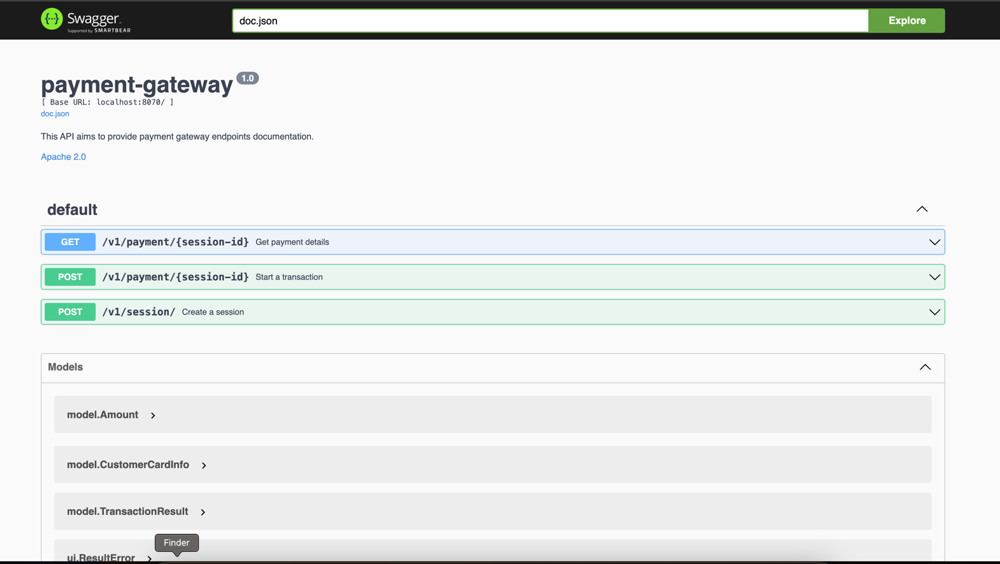

[](https://github.com/SenRed/Payment-Gateway/actions/workflows/linting.yml)
[](https://github.com/SenRed/Payment-Gateway/actions/workflows/testing.yml)

# Payment Gateway Project
## Table of Contents

<!-- TOC -->
* [Payment Gateway Project](#payment-gateway-project)
  * [Table of Contents](#table-of-contents)
  * [Introduction](#introduction)
  * [Assumptions and Scope](#assumptions-and-scope)
  * [General Workflow](#general-workflow)
    * [1. Create a Payment Session](#1-create-a-payment-session)
    * [2. Start the Payment Session](#2-start-the-payment-session)
    * [3. Retrieve the Detail of a Payment Session](#3-retrieve-the-detail-of-a-payment-session)
  * [How the System Works Internally](#how-the-system-works-internally)
    * [Why Should We Create a Session Before Initiating Payment?](#why-should-we-create-a-session-before-initiating-payment)
    * [How to Reflect the Business logic into the Source Code?](#how-to-reflect-the-business-logic-into-the-source-code)
  * [How to Use the Project](#how-to-use-the-project)
    * [Before Starting](#before-starting)
    * [Starting the Project](#starting-the-project)
    * [API Documentation](#api-documentation)
    * [How to Test](#how-to-test)
    * [Bank simulator](#bank-simulator)
  * [Areas of Improvement](#areas-of-improvement)
    * [Solutions](#solutions)
  * [Conclusion](#conclusion)
<!-- TOC -->
 
## Introduction
Payement Ecosystem is incredibly complex, [Alex XU](https://blog.bytebytego.com/i/78608860/the-payments-ecosystem) did a great job summarizing on part of payment ecosystem, as following


In this project, we focus primarily on steps 2 and 3, while acknowledging that other steps exist but are beyond the scope of our current focus.
However, we've made efforts to simulate interactions related to those steps.

In order to achieve that, I have implemented the following functionalities:
1. A merchant should be able to process a payment through the payment gateway and receive either a successful or unsuccessful response.
2. A merchant should be able to retrieve the details of a previously made payment.
3. To process the payment request, I have built a bank processor simulator.

## Assumptions and Scope
To keep this project simple, I made a few assumptions, which are as follows:
- Authentication and authorization flows like 3D-secure are out of scope.
- The merchant is already registered and known in the system, and we know which acquiring bank processor he belongs to.
- We handle only one payment method, which is the card.
- Capture, which is the process of transferring the money to the merchant's account, is out of scope.
- We don't manage the merchant's balance after a transaction.
- We focus mainly on the payment gateway system; no code for the merchant website or what happens after the acquiring bank processor.

## General Workflow
There are 3 major steps in the system:

### 1. Create a Payment Session
The merchant sends the payment information:
- A unique session ID, used as an **idempotency key**.
- The amount and currency.
- Customer card information. 

### 2. Start the Payment Session
After a session creation, the merchant system starts the execution of the payment. 
The result of this call is the payment status: success or failure with an explanation.

### 3. Retrieve the Detail of a Payment Session
At any time, the merchant could retrieve the details of a payment session.

## How the System Works Internally
We can summarize the payment workflow as follows:


### Why Should We Create a Session Before Initiating Payment?
The decision to create a session first was made to address scenarios involving a loss of connection between the merchant system and the payment gateway.
Consider the following scenario: 


In this scenario, the payment transaction ends with success, indicating that the system has charged the customer's wallet.

However, if the merchant website loses its connection to the payment gateway, the merchant system may not proceed with the delivery because, at the merchant level, the transaction is still ongoing.

To mitigate this, I introduced an idempotency key. With this approach, the merchant website can retry multiple calls, ensuring that the end result remains consistent.

### How to Reflect the Business logic into the Source Code?
For the purpose of this project, I chose to use a few concepts of Domain-Driven-Design and hexagonal architecture.

## How to Use the Project
### Before Starting
To start a project, you need:
- [Docker](https://docs.docker.com/engine/install/) installed.
- [Go](https://go.dev/doc/install) installed.

Optionally:
- [Swag](https://github.com/swaggo/swag/tree/master) to generate API documentation
- [Mockgen](https://github.com/golang/mock) to generate Mocks

### Starting the Project
You can use:
```bash
make start
```
Other commands:

| Command               |  Alias  |                          Description |
|-----------------------|:-------:|-------------------------------------:|
| make start            | make s  |                    Start the project |
| make test             | make t  | Run unit test and functional testing |
| make unit_test        | make ut |                        Run unit test |
| make integration_test | make it |                  Run functional test |
| make lint             |    -    |                        Lint the code |
| make generate_mock    |    -    |                       Generate mocks |
| make generate_doc     |    -    |           Generate API documentation |


### API Documentation
When the server is up, the API documentation is accessible at this link: http://localhost:8070/swagger/index.html#/



### How to Test
To make testing easy, I provide a Postman collection with different use cases covering the following file: [Postman collection](docs%2FPayment%20gateway.postman_collection.json)

To test, follow these 3 steps:
1. Create a session
2. Start the session
3. Retrieve session information
All these steps are already provided in the Postman collection.

### Bank simulator
To simulate different conditions, I created 3 scenarios as follows:
1. Successful transaction:
To test a successful transaction, follow the 3 steps mentioned above: (create a session, start the session, and retrieve details)
2. Customer with Invalid CVC:
For an invalid CVC, use the ```invalid-cvc``` keyword in the customer's card number; it should simulate an invalid CVC session.
3. Customer with Insufficient Funds:
For insufficient funds, use the ```insufficient-funds``` keyword in the customer's card number; it should simulate an insufficient session.

All these use cases are provided in [the Postman Collection](docs%2FPayment%20gateway.postman_collection.json)

## Areas of Improvement
Let's say we want to deploy this application behind a load balancer; the system design would look like this:

One of the issues we are facing is that processing the payment may take a long time, resulting in a loss of connection between the merchant and the payment system.

### Solutions
1. Maintain the connection by using keep-alive, but this solution is deprecated and may result in resource consumption.
2. Instead of waiting for the response, the client could receive the result by providing a callback endpoint, and in the meantime, the payment gateway could process the payment request asynchronously.

To implement asynchronous calls, we can introduce a Pub/Sub component listened by a worker that processes 
the payment and notify the system when processing is finished. This is how Uber did it for their [reliable payment system](https://www.youtube.com/watch?v=5TD8m7w1xE0&ab_channel=UberEngineering)

The system design could look like this:


Regarding the technologies for this system and assuming we can use Google Cloud Provider, I would suggest the following:
- For Worker, we can use [Cloud Functions](https://cloud.google.com/functions/docs/console-quickstart)
- For Pub/Sub component, we can use [Cloud Pub/Sub](https://cloud.google.com/pubsub?hl=en): It's a Pub/Sub component and one of the main functionalities; we can implement a retry policy easily.

One interesting functionality, Google provides an emulator to test locally a system with those two components.

## Conclusion
Developing a payment gateway is a complex task, In this project, I tried to provide few functionalities such an idempotency key to ensure consistent results for payment transactions, and a simulator to replicate faulty user behaviors. 

Beyond these functionalities, the project incorporates a number of technical features that haven't been addressed, like aggregate roots in DDD, business tests developed in Gherkin, using an ORM, gracefully shutdown, Github action for CI/CD...ect

These technical aspects enhance the robustness and reliability of the payment gateway system, contributing to its effectiveness in real-world scenarios.